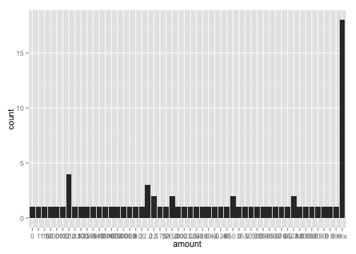
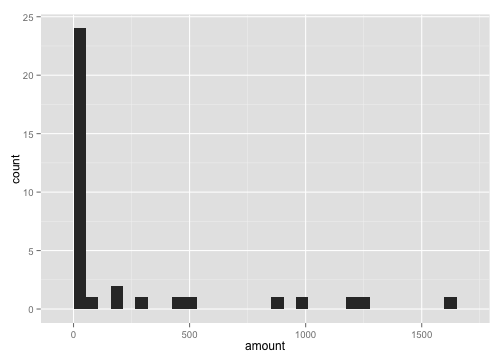

<link href="http://kevinburke.bitbucket.org/markdowncss/markdown.css" rel="stylesheet"></link>
An introduction to formhub.R
========================================================

Installation
------------
formhub.R makes is easy to download and work with datasets on [formhub](http://formhub.org). After downloading, formhub.R post-processes your dataset to convert the different columns to the correct type, which it derives from the `type` you specified during the creation of your XLSform. It is distributed as an R package called `formhub` which is not in CRAN yet, and can be installed in the following way:

```
  install.packages("devtools")
  library(devtools)
  install_github("formhub.R", username="modilabs")
```

The `install_github` line will need to be re-run every time you need to update the package, which will be frequent for now, as the package is in early testing. After installation, it can be loaded like you load any other R package:


```r
library(formhub)
```


Download your first dataset
---------------------------
At this point, we should be ready to get started, and use some of the formhub functions. Likely the most useful, and the most basic, one is called `formhubDownload`. Try typing in `help(formhubDownload)` in your R terminal to see what it does. We'll use it to download the `good_eats` form from mberg's account in formhub, which is a public dataset and doesn't require a password. (To download data from an account with a password, simply pass it along as the third parameter).


```r
good_eats <- formhubDownload("good_eats", "mberg")
```


The formhubData Object
----------------------

Question: what kind of beast did we just download?

```r
str(good_eats)
```

```
## 'data.frame':	78 obs. of  19 variables:
## Formal class 'formhubData' [package ".GlobalEnv"] with 5 slots
##   ..@ .Data    :List of 19
##   .. ..$ : POSIXct, format: "2011-12-30" ...
##   .. ..$ : Factor w/ 11 levels "caffeination",..: 11 4 10 10 2 1 6 6 6 3 ...
##   .. ..$ : chr  "Turkish burger " "Shisha! " "Fistikli" "Turkish donuts" ...
##   .. ..$ : num  2 20 2 2 2.75 2.5 18 8 20 1600 ...
##   .. ..$ : Factor w/ 4 levels "bad","delectible",..: 2 2 2 2 3 3 3 2 2 3 ...
##   .. ..$ : chr  NA "Should have brought a board game! " "Great staff" "Pure oil and honey" ...
##   .. ..$ : Factor w/ 3 levels "high_risk","low_risk",..: 2 2 2 2 2 2 2 2 2 2 ...
##   .. ..$ : chr  NA "1325234084489.jpg" "1325233793480.jpg" "1325233641666.jpg" ...
##   .. ..$ : chr  NA "Kosebasi Nargile " "Tatlic Safa" "Tahiri Osmanli Lokmaci" ...
##   .. ..$ : chr  NA "1325234137252.jpg" "1325233817453.jpg" "1325233694501.jpg" ...
##   .. ..$ : chr  "41.01452808827162 28.97566007450223 57.4000244140625 30.0" NA "41.016706293448806 28.970129443332553 44.9000244140625 40.0" "41.0182375414297 28.97094827145338 39.0 30.0" ...
##   .. ..$ : num  41 NA 41 41 41 ...
##   .. ..$ : num  29 NA 29 29 29 ...
##   .. ..$ : num  57.4 NA 44.9 39 39.9 ...
##   .. ..$ : num  30 NA 40 30 40 20 35 85 60 75 ...
##   .. ..$ : Factor w/ 25 levels "351746052009472",..: 15 15 15 15 15 15 15 15 15 15 ...
##   .. ..$ : POSIXct, format: "2011-12-30" ...
##   .. ..$ : chr  "030e20a618f74ac1ad597b35883f4314" "1f41b91b1d8748cfa60b7361620c7a58" "3f2f315ba01947e8bd918399cf5408b1" "41260d9d9b1944ce8aa91c9e7427a891" ...
##   .. ..$ : chr  "2011-12-30T08:44:00" "2012-01-01T14:10:14" "2011-12-30T09:53:56" "2011-12-30T08:19:48" ...
##   ..@ form     :'data.frame':	13 obs. of  3 variables:
##   .. ..$ name : chr  "submit_data" "food_type" "description" "amount" ...
##   .. ..$ type : Factor w/ 7 levels "decimal","geopoint",..: 7 5 6 1 5 6 5 4 6 4 ...
##   .. ..$ label: chr  "submit_data" "Type of Eat" "Description" "Amount" ...
##   ..@ names    : chr  "submit_data" "food_type" "description" "amount" ...
##   ..@ row.names: int  1 2 3 4 5 6 7 8 9 10 ...
##   ..@ .S3Class : chr "data.frame"
```


R tells us something like `'data.frame':  78 obs. of  19 variables:` as well as `Formal class 'formhubData' [package ".GlobalEnv"] with 5 slots`. What this means is that formhubData objects can be dealt with as data frames (which makes them very convenient!) and well as "objects" with more properties (such as `form`, which is derived from your XLSform). The `form` gives formhub.R information about the exact question that was asked, and the type of the question asked (was it `text` or `select one`? or was it a `date`?), which lets the library change the types of the values to make them right, which is basically the power of this package.

For simplicity, if you want just a data frame and not this complicated formhubData object, you can always use the `as.data.frame` method.


```r
good_eats_pure_data_frame <- as.data.frame(good_eats)
```


What formhub.R does for you -- type conversions
-----------------------------------------------

So the part where R downloaded your data for you was pretty cool. But there is more to the `formhubDownload` function than just downloading. In the background, the types of each of the columns is converted according to how the data was collected.

```r
# lets inspect the types of the first 10 columns of our downloaded data
str(as.data.frame(good_eats)[1:10])
```

```
## List of 10
##  $ : POSIXct[1:78], format: "2011-12-30" "2011-12-30" ...
##  $ : Factor w/ 11 levels "caffeination",..: 11 4 10 10 2 1 6 6 6 3 ...
##  $ : chr [1:78] "Turkish burger " "Shisha! " "Fistikli" "Turkish donuts" ...
##  $ : num [1:78] 2 20 2 2 2.75 2.5 18 8 20 1600 ...
##  $ : Factor w/ 4 levels "bad","delectible",..: 2 2 2 2 3 3 3 2 2 3 ...
##  $ : chr [1:78] NA "Should have brought a board game! " "Great staff" "Pure oil and honey" ...
##  $ : Factor w/ 3 levels "high_risk","low_risk",..: 2 2 2 2 2 2 2 2 2 2 ...
##  $ : chr [1:78] NA "1325234084489.jpg" "1325233793480.jpg" "1325233641666.jpg" ...
##  $ : chr [1:78] NA "Kosebasi Nargile " "Tatlic Safa" "Tahiri Osmanli Lokmaci" ...
##  $ : chr [1:78] NA "1325234137252.jpg" "1325233817453.jpg" "1325233694501.jpg" ...
```


Notice that `submit_data` and `submit_date`, both of which were `today` (ie, date) questions in your form, are converted to `POXIXct`, which is R's date type. What does this mean? That means that we can do date-time calculations, for example, to check how long mberg has been collecting data:

```r
max(good_eats$submit_data) - min(good_eats$submit_date)
```

```
## Time difference of 490 days
```

Over a year... awesome!

Similiarly, things like `select one`, `imei`, and others are converted to factors, `integers` and `decimals` to numbers. Lets see how this compares with if we had simply just read the file as a csv without any type conversions:

```r
good_eats2 <- read.csv("~/Downloads/good_eats_2013_05_05.csv")
# lets inspect the types of the first 10 columns of our downloaded data
str(good_eats2[1:10])
```

```
## 'data.frame':	78 obs. of  10 variables:
##  $ submit_data   : Factor w/ 52 levels "2011-12-30","2011-12-31",..: 1 1 1 1 1 6 4 5 8 10 ...
##  $ food_type     : Factor w/ 12 levels "caffeination",..: 12 4 11 11 2 1 6 6 6 3 ...
##  $ description   : Factor w/ 62 levels "A nice cup of black tea to start the day off",..: 59 49 18 61 6 60 52 12 46 51 ...
##  $ amount        : Factor w/ 52 levels "0","1","1.5",..: 20 24 20 20 22 21 17 45 24 15 ...
##  $ rating        : Factor w/ 5 levels "bad","delectible",..: 2 2 2 2 3 3 3 2 2 3 ...
##  $ comments      : Factor w/ 40 levels "Better with Pili Pili ",..: 23 30 16 28 32 23 23 23 13 11 ...
##  $ risk_factor   : Factor w/ 4 levels "high_risk","low_risk",..: 2 2 2 2 2 2 2 2 2 2 ...
##  $ food_photo    : Factor w/ 40 levels "1325233641666.jpg",..: 35 4 2 1 3 10 8 9 12 14 ...
##  $ location_name : Factor w/ 47 levels "Addigas ","Ambience Mall, Gurgaon, India",..: 29 24 39 37 21 29 43 40 15 16 ...
##  $ location_photo: Factor w/ 29 levels "1325233694501.jpg",..: 22 4 2 1 3 9 7 8 11 22 ...
```

Everything is a factor! Why is that bad? Well, see the plots below for yourself:

```r
# install.packages('ggplot2') if you don't have ggplot2 installed yet
library(ggplot2)
qplot(data = good_eats2, x = amount)  # from data read in without formhub.R
```

 

```r
qplot(data = good_eats, x = amount)  # from data read in using formhub.R
```

 


Other functions in formhub.R
----------------------------
Okay, hopefully by now, you are sold on the usefulness of formhub.R, and see some value in it. Since this is a "basics of" document, I'll end by describing a couple of other high-level functions in formhub.R (lower-level functions will be documented over time).

  * `formhubDownload` -- download data directly from formhub by passing form name, username, and password for private data
  * `formhubRead` -- create a formhubData object from pre-downloaded files. The first file argument is the csv file, the second is the form.json file (which you can download from the form page on formhub). Note: unexpected things will happen if the files aren't the right ones. See the full documentation by using `help(formhubRead)`.
  * `replaceHeaderNamesWithLabels` -- get a version of the data where the header row is re-written as the actual question asked.
  
And thats really the gist of it!

What if I get an error while running a function?
------------------------------------------------
This is software that has been tested by only a couple of use cases so far, and writing good code in R is pretty tricky, so there are probably bugs! If you encounter one, please go to your form page, and under "Sharing", give the username "prabhasp" "View" privileges, and file an [issue on github](http://github.com/modilabs/formhub.R/issues)
