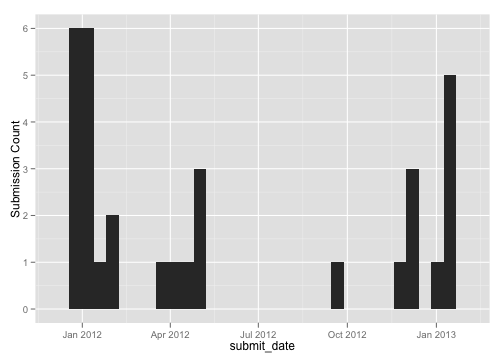
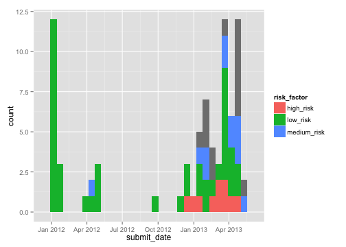

<link href="http://kevinburke.bitbucket.org/markdowncss/markdown.css" rel="stylesheet"></link>
A simple example using formhub.R -- good eats
========================================================

formhub.R makes is easy to download and work with datasets on [formhub](http://formhub.org). After downloading, formhub.R post-processes your dataset to convert the different columns to the correct type, which it derives from the `type` you specified during the creation of your XLSform. If you haven't read the [basics document](http://modilabs.github.com/formhub.R/demo/Basics_of_formhub.R.html), I recommend that you read that first.

Let us illustrate this with a simple example:


```r
library(formhub)
# Download the dataset named good_eats in the account of mberg
good_eats_data <- as.data.frame(formhubDownload("good_eats", "mberg"))
```


The downloaded data has its fields converted to the right types, something we'll look at in depth later. Before we do that, lets present a quick example of the power of these conversions by looking at dates. Can we look at how much data mberg has been submitting over time?


```r
# install.packages('ggplot2') if you don't have ggplot2 installed yet
library(ggplot2)
qplot(data = good_eats_data, x = submit_date) + ylab("Submission Count")
```

 


How about riskiness of the food he is trying and reporting about... has that changed over time?

```r
qplot(data = good_eats_data, x = submit_date, fill = risk_factor)
```

 

Looks like it has! mberg's getting riskier as time goes on.
