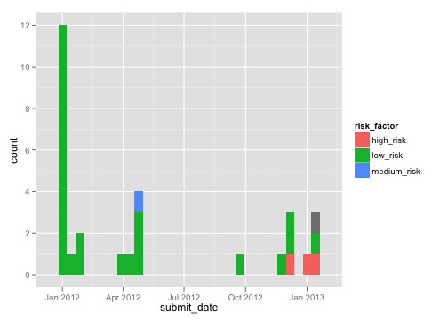

A simple example using formhub.R
========================================================

formhub.R makes is easy to download and work with datasets on formhub.R. After downloading, formhub.R post-processes your dataset to convert the different columns to the correct type, which it derives from the `type` you specified during the creation of your XLSform.

Let us illustrate this with a simple example:


```r
# Download the dataset named good_eats in the account of mberg
source("../formhub.R")
good_eats <- formhubDownload("good_eats", "mberg")
```


The downloaded data has its fields converted to the right types, something you could discover by checking `str(good_eats)`. Note how gpplot can take advantage of the right type information for `submit_date`: 


```r
library(ggplot2)
qplot(data = good_eats, x = submit_date, fill = risk_factor)
```

 


