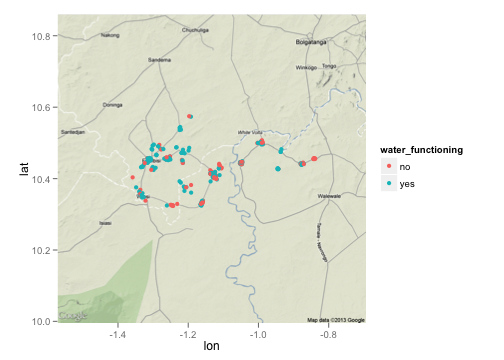

Quick maps using formhub.R -- north ghana
========================================================

formhub.R makes is easy to download and work with datasets on formhub.R. In this showcase, I'll show off how formhub.R makes it easy to make printable maps... just like the ones available on formhub.org for you to view.

This time, we'll be using a water point dataset from Northern Ghana. I am not at liberty to show you the full dataset, but maps aren't a problem. Plus, that gives me an excuse to demonstrate how formhub.R can import datasets from a file. The inputs required are two files, the `csv` file that makes up your data and the `form.json` file, which is a convenient representation of the XLSform used to collect data in the first place.


```r
# Read north ghana water points dataset directly from saved data and form.
source("../formhub.R")
waterpoints <- formhubRead("~/Downloads/_08_Water_points_train3_2012_09_06.csv", 
    "~/Downloads/_08_Water_points_train3.json")
```


A quick `str(waterpoints)` can verify that the type conversions have been done properly; output excluded for brevity here.

Lets get to maps! A quick one just to help us get the lay of the land (longitude / latitudes are just x / y co-ordinates after all).


```r
library(ggplot2)
qplot(data = waterpoints, x = X_water_point_geocode_longitude, y = X_water_point_geocode_latitude)
```

 


In order to get a real map background in there, we'll use the ggmap package, and also look at a property to visualize; lets pick the `water_functional` attribute (corresponding to the question: Is the water source able to provide water right now?)


```r
library(ggmap)
center_point <- c(lon = mean(waterpoints$X_water_point_geocode_longitude, 
    na.rm = T), lat = mean(waterpoints$X_water_point_geocode_latitude, na.rm = T))
ngbaselayer <- ggmap(get_map(location = center_point, source = "google", 
    filename = "maptemp", zoom = 10))
ngbaselayer + geom_point(data = waterpoints, aes(x = X_water_point_geocode_longitude, 
    y = X_water_point_geocode_latitude, color = water_functioning))
```

 


And here is a hexagonal binning of the counts in this dataset (with points laid over transparently), with two different bin sizes:


```r
ngbaselayer + 
   stat_binhex(data=waterpoints, color="grey", # bins = 30 by default
         aes(x=X_water_point_geocode_longitude, y=X_water_point_geocode_latitude)) + 
   geom_point(data=waterpoints, color="orange", alpha=0.3,
         aes(x=X_water_point_geocode_longitude, y=X_water_point_geocode_latitude))
```

 

```r
ngbaselayer +
  stat_binhex(data=waterpoints, color="grey", bins=10,
         aes(x=X_water_point_geocode_longitude, y=X_water_point_geocode_latitude)) + 
   geom_point(data=waterpoints, color="orange", alpha=0.3,
         aes(x=X_water_point_geocode_longitude, y=X_water_point_geocode_latitude))
```

 


Unfortunately, I'm not quite sure how we can replicate the formhub.org-style density hexbins, which tell us areas in which a high proportion of existing water points are non-functional. However, we can map where there is a prepondenderence of non-functioning water points within our set:


```r
ngbaselayer + stat_binhex(data = waterpoints, aes(x = X_water_point_geocode_longitude, 
    y = X_water_point_geocode_latitude)) + geom_point(data = waterpoints, alpha = 0.7, 
    aes(x = X_water_point_geocode_longitude, y = X_water_point_geocode_latitude, 
        color = water_functioning))
```

 


Moving on, how about we use a Northern Ghana district shapefile to make a choropleth of where water is functional and not?
